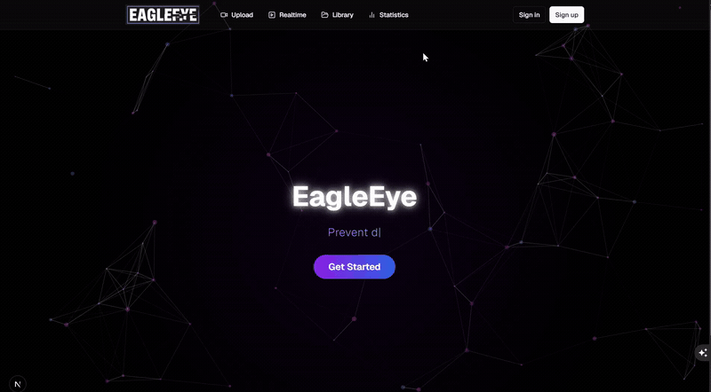
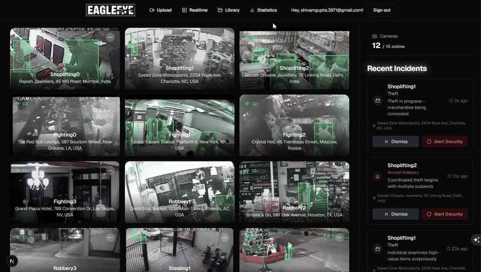

# EagleEye - AI-Powered Security Surveillance

## Inspiration
In an era where security cameras are everywhere but meaningful surveillance is scarce, we saw an opportunity to transform passive recording systems into intelligent security guardians. Our inspiration came from real-world incidents where crucial moments were missed despite having camera coverage, and the overwhelming challenge security personnel face in monitoring multiple video feeds simultaneously. We wanted to create a solution that doesn't just record but understands, analyzes, and acts, whether it's for local businesses like grocery markets to bigger organizations like hospitals and shopping malls.

## What it does
EagleEye is an intelligent video surveillance platform that detects crime, suspicious activities and life threatening events such as fainting and choking and sends phone alerts to alert security of the issue. Our intelligent model generates time-stamped incident reports with video evidence. It has 4 main features:
1. **Real-time detection** of dangerous activity by sending audio, video, and TensorFlow's body position data to Google's Gemini Visual Language Model, sending email notifications when needed.
2. **An upload feature** that allows existing MP4 files to be analyzed for security events.
3. **A library of saved livestream footage and MP4 uploads**, with detailed security analysis complete with timeline and incident info.
4. **Statistics page** offering AI summaries, chart analysis, and options to export situation data to CSV.

### Additional features
* Sends instant alerts to security through email/phone notifications.
* Provides an intuitive dashboard for monitoring multiple cameras, with the option to call security.
* Ability to download archive footage to MP4.
* Offers an OpenAI-powered assistant that provides contextual support. The bot is fed real-time information about ongoing events to respond to user queries (e.g. *"What should I do in this situation?"*) with context-aware advice.
* Offers both real-time streaming and uploaded video analysis.

## How we built it
Our tech stack combines modern tools for a robust, scalable solution:
* **Frontend**: Built with Next.js 13+ and TypeScript, paired with Tailwind CSS for a sleek, responsive design.
* **Backend**: We use Supabase for secure user authentication and database management.
* **AI Processing**: Google's Gemini Visual Language Model (VLM) for real-time video analysis and TensorFlow.js for processing video streams on the client side.
* **Email/Phone Service**: Resend API powers our email and notification system.
* **Real-time Updates**: Canvas API for live updates and frame analysis.
* **Contextual Assistance**: OpenAI’s language models power our assistant bot for real-time situational guidance.

## Challenges we ran into
1. **Performance Optimization**: Balancing real-time video processing with browser performance and Gemini rate limits.
2. **AI Model Accuracy**: Fine-tuning detection algorithms to minimize false positives.
3. **Video Stream Handling**: Managing multiple video streams without overwhelming the system.

## Accomplishments that we're proud of
* Created a fully functional AI surveillance system in 36 hours.
* Achieved real-time processing with minimal latency.
* Implemented a beautiful, intuitive user interface.
* Built a scalable architecture that can handle multiple cameras.
* Developed a system that's accessible through any modern browser.

## What we learned
* Advanced video processing techniques in the browser.
* Real-time data handling with WebSocket connections to handle real-time updates effectively.
* AI model optimization for edge cases.
* Complex state management in React applications, especially when dealing with large datasets.
* Integration of multiple third-party services.
* The importance of user experience in security applications.

## What's next for EagleEye
1. **Advanced AI Features**: Person identification/recognition, object tracking across multiple cameras, behavioral pattern analysis.
2. **Enhanced Security**: End-to-end encryption, GDPR compliance tools, advanced access control.
3. **Smart Home Integration**: Integration with popular smart home platforms, automated response actions, voice assistant compatibility.

## Built With
* ChatGPT
* Gemini
* MP4
* Next.js
* React
* Resend
* Supabase
* TensorFlow
* TypeScript
* VLM
